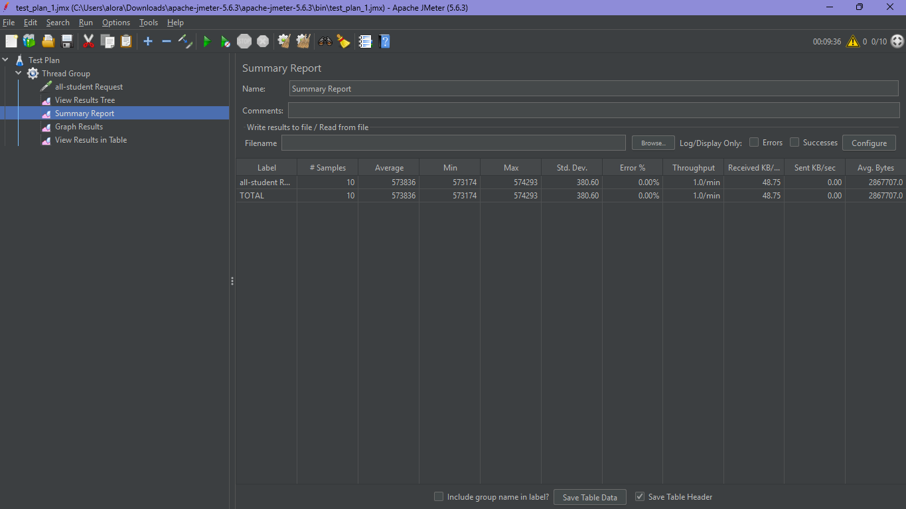
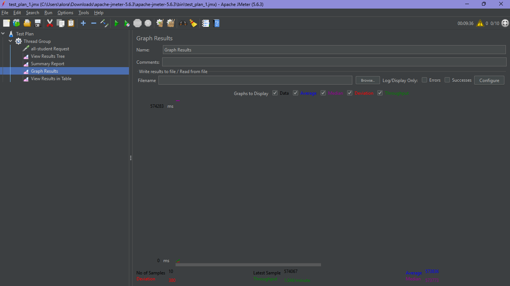
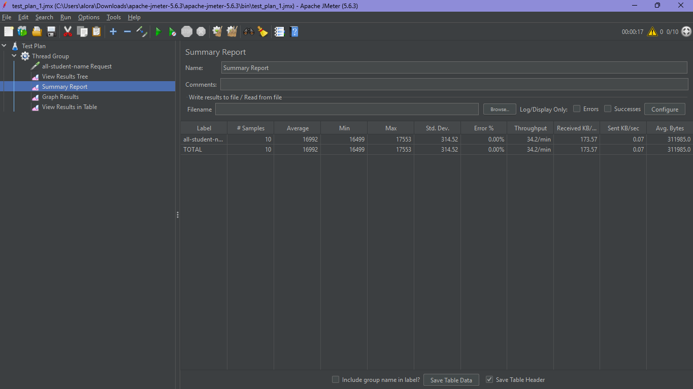
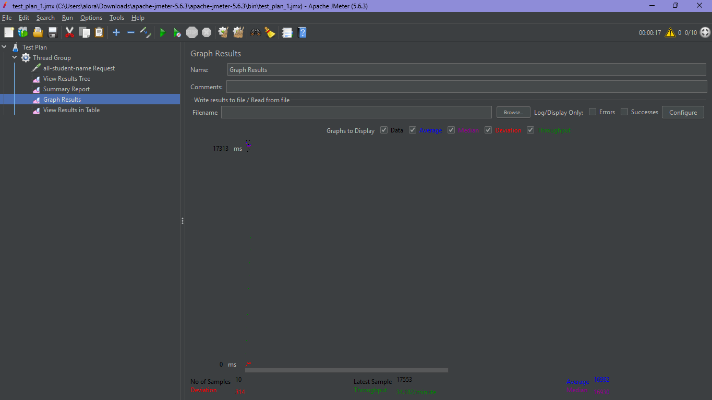
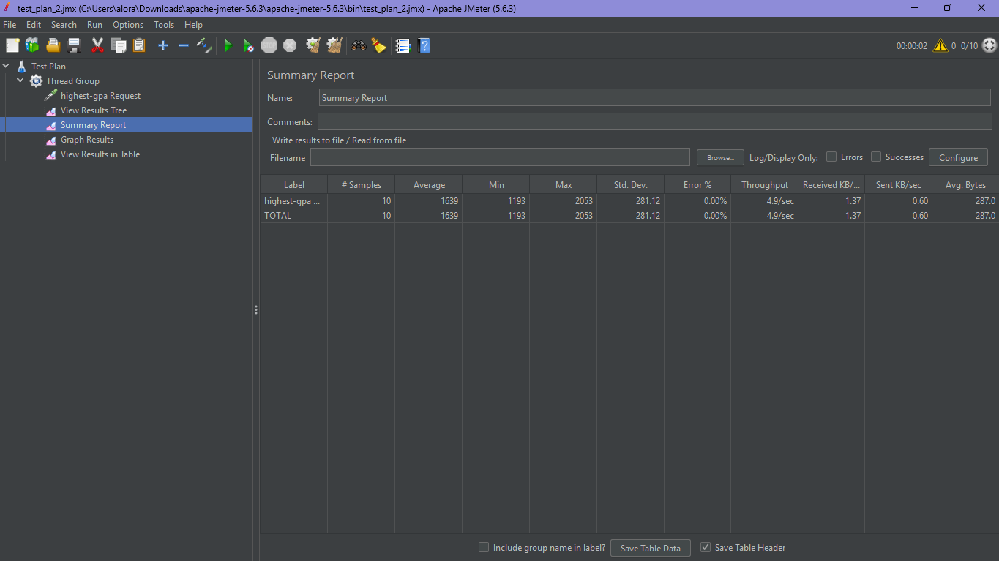
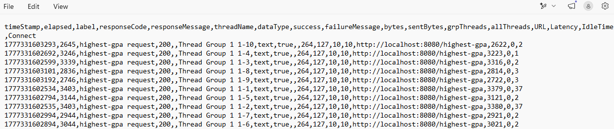
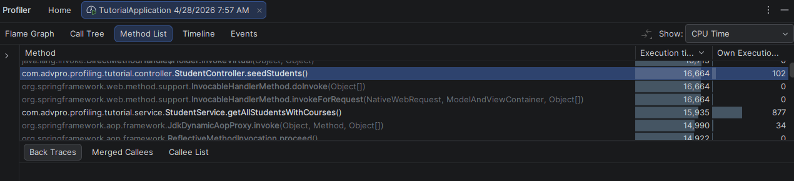
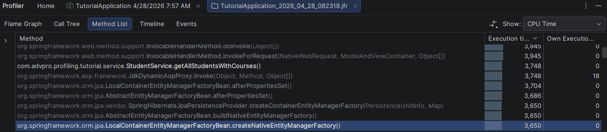

<b>Result (JMeter & Profiler)</b>

### Test Results (VIA GUI)
#### /all-student

* Results Tree

* Summary Reports

* Graph Results

* Results Table

#### /all-student-name

* Results Tree
  
* Summary Reports
  
* Graph Results
  
* Results Table
  

#### /highest-gpa

* Results Tree
  
* Summary Reports
  
* Graph Results
  
* Results Table
  

### Test Results (VIA CLI)

#### /all-student

#### /all-student-name

#### /highest-gpa

<b>Reflection</b>

#### 1. What is the difference between the approach of performance testing with JMeter and profiling with IntelliJ Profiler in the context of optimizing application performance?
JMeter menguji dari **luar** (sebagai *user* yang memberi beban/trafik dan mengukur waktu respons server). IntelliJ Profiler membedah dari **dalam** (melihat secara detail baris kode/metode mana di dalam Java yang paling memakan CPU dan memori).

####  2. How does the profiling process help you in identifying and understanding the weak points in your application?
Profiler memetakan alur eksekusi kode (melalui *Call Tree* atau *Flame Graph*) dan menunjukkan persentase waktu CPU yang dihabiskan. Jadi, kita bisa langsung melihat bagian kode mana yang menjadi *bottleneck* (titik lemah) tanpa perlu menebak-nebak.

#### 3. Do you think IntelliJ Profiler is effective in assisting you to analyze and identify bottlenecks in your application code?
Sangat efektif. Karena terintegrasi langsung dengan IDE, kita bisa langsung melompat dari grafik visual (yang menunjukkan masalah seperti N+1 query) ke baris kode yang bermasalah untuk segera diperbaiki.

#### 4. What are the main challenges you face when conducting performance testing and profiling, and how do you overcome these challenges?
**Tantangan:** Membaca tumpukan *Call Tree* yang sangat dalam dan membedakan mana proses internal Spring/Tomcat dan mana kode buatan sendiri.
**Solusi:** Fokus menelusuri metode yang memakan waktu eksekusi terbesar (*Total Time* terbesar) dan mencari nama *package* aplikasi kita sendiri.

#### 5. What are the main benefits you gain from using IntelliJ Profiler for profiling your application code?
Sangat menghemat waktu *debugging* performa, memberikan bukti nyata letak inefisiensi, dan memiliki fitur *Comparison* untuk memvalidasi apakah *refactoring* yang kita lakukan benar-benar berdampak positif atau tidak.

#### 6. How do you handle situations where the results from profiling with IntelliJ Profiler are not entirely consistent with findings from performance testing using JMeter?
Jika Profiler menunjukkan kode sudah cepat tapi JMeter masih lambat, masalahnya biasanya ada di luar kode Java. Saya akan mengecek faktor eksternal seperti latensi jaringan, koneksi *database*, atau memastikan JVM sudah melakukan *warm-up* sebelum diukur oleh JMeter.

#### 7. What strategies do you implement in optimizing application code after analyzing results from performance testing and profiling? How do you ensure the changes you make do not affect the application's functionality?
**Strategi:** Memindahkan beban pemrosesan data (seperti *looping*, *sorting*, dan filter kolom) dari level Java ke level *Database* (menggunakan *Query*, *JOIN FETCH*, atau *Projection*).
**Menjaga Fungsi:** Selalu menjalankan **Unit Test** yang sudah dibuat sebelumnya setiap kali selesai melakukan *refactoring* untuk memastikan *output* aplikasi tidak berubah.

**Kesimpulan Evaluasi Performa:**

Ya, terdapat peningkatan performa yang sangat signifikan dari hasil pengukuran JMeter. Sebelum optimasi, aplikasi berjalan lambat karena adanya *N+1 query problem* dan inefisiensi pencarian di level Java yang membebani memori dan CPU.

Setelah melakukan *refactoring*, seperti menerapkan `JOIN FETCH`, menggunakan *projection*, dan mendelegasikan proses *sorting* ke level *database*, *Sample Time* (waktu respons) pada JMeter menurun drastis. Metode `getAllStudentsWithCourses` berhasil berkurang dari 15.935 ms menjadi hanya 3.748 ms (terjadi peningkatan performa lebih dari 75%). Begitu juga dengan metode `findStudentWithHighestGpa` dan `joinStudentNames`. Aplikasi jadi mampu menangani *request* dengan jauh lebih cepat, efisien, dan stabil.

**Sebelum refactoring**

**Sesudah refactoring**

