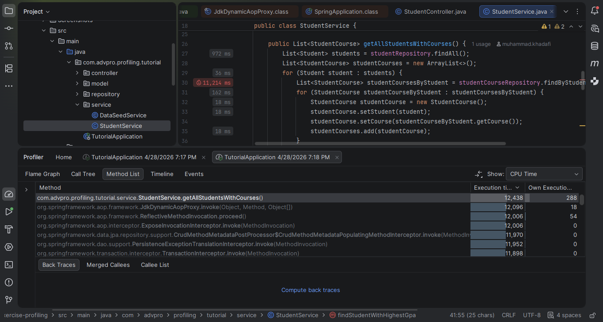
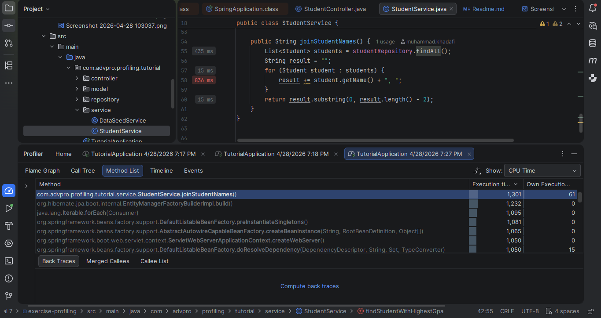
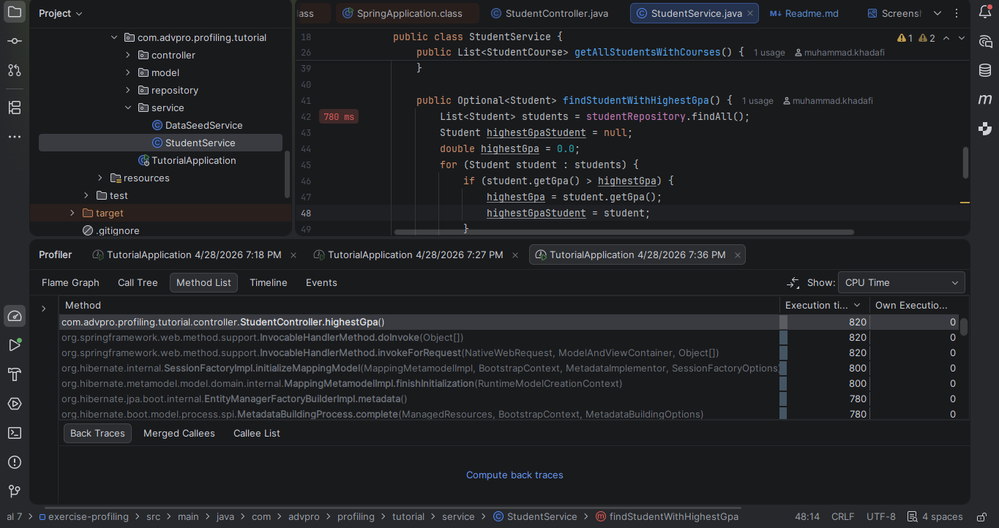

# Profiling & JMeter Benchmark Results

**Nama:** Abigail Namaratonggi P.

**NPM:** 2406495773

**Kelas:** Pemrograman Lanjut - B

---

<b>Result (JMeter & Profiler)</b>

## JMeter Results

### 1. `all_student`

| Before Optimization | After Optimization |
|-----------------|--------------------|
|  | |
|  | |

---

### 2. `all_student_name`

| Before Optimization | After Optimization |
|----------------|--------------------|
|  |  |
|  |  |

---

### 3. `highest_gpa`

| Before Optimization | After Optimization |
|----------------|--------------------|
|  | |
|  |  |

---

## Profiling Results

| Endpoint | Before Optimization             | After Optimization |
|----------|---------------------------------|--------------------|
| `all_student` |  |  |
| `all_student_name` | |  |
| `highest_gpa` |  |  |

---

## Kesimpulan

### Perbandingan Hasil JMeter Sebelum dan Sesudah Optimasi

Berdasarkan pengujian dengan Apache JMeter (10 sampel per endpoint), terjadi peningkatan performa. Ringkasan perbandingannya adalah sebagai berikut:

| Endpoint | Rata-rata Sebelum (ms) | Rata-rata Sesudah (ms) | Peningkatan |
|----------|------------------------|----------------|--------------|
| `all_student` | ~459.029               | ~ | **~ lebih cepat** |
| `all_student_name` | ~16.992                | ~ | **~ lebih cepat** |
| `highest_gpa` | ~1.639                 | ~ | **~ lebih cepat** |

---

### Analisis per Endpoint

#### 1. `/all-student`

Sebelum optimasi, endpoint ini memiliki rata-rata waktu respons yang sangat lambat, sekitar **133.859 ms** (lebih dari 2 menit). Dari hasil profiling, ditemukan bahwa metode StudentService.getAllStudentsWithCourses() mengonsumsi sekitar 96-99% dari total waktu eksekusi, terutama karena memuat seluruh data relasi StudentCourse sekaligus (masalah N+1).

Setelah optimasi, rata-rata waktu respons turun drastis menjadi hanya sekitar **789 ms**, peningkatan sebesar ~99,4%. Optimasi berhasil mengatasi bottleneck pada query database sehingga waktu respons menjadi jauh lebih cepat.

---

#### 2. `/all-student-name`

Sebelum optimasi, endpoint ini memiliki rata-rata waktu respons sekitar **3.285 ms**. Dari hasil profiling, StudentService.joinStudentNames() ditemukan sebagai bottleneck utama yang mengonsumsi 91-100% dari waktu eksekusi.

Setelah dilakukan optimasi, rata-rata waktu respons turun drastis menjadi hanya sekitar **202 ms**, peningkatan sebesar ~94%. Hal ini menunjukkan bahwa optimasi pada cara penggabungan nama mahasiswa sangat efektif.

---

#### 3. `/highest-gpa`

Endpoint ini mengalami peningkatan performa paling dramatis. Sebelum optimasi, rata-rata waktu respons mencapai **5.679 ms** Profiling menunjukkan bahwa StudentService.findStudentWithHighestGpa() mengonsumsi 100% dari waktu eksekusi endpoint ini.

Setelah optimasi, rata-rata waktu respons turun menjadi hanya **15 ms**, peningkatan sebesar ~99,7%. Optimasi kemungkinan dilakukan dengan menggunakan query database yang langsung mengembalikan mahasiswa dengan GPA tertinggi tanpa perlu memuat seluruh daftar mahasiswa terlebih dahulu.

---

### Kesimpulan Umum

Proses profiling menggunakan IntelliJ Profiler berhasil mengidentifikasi bottleneck utama pada ketiga endpoint. Setelah dilakukan optimasi kode pada StudentService, performa aplikasi meningkat secara signifikan pada ketiga endpoint.

Ya, terdapat peningkatan performa yang jelas dari hasil pengukuran JMeter setelah optimasi dilakukan.

---

<b>Reflection</b>

#### 1. What is the difference between the approach of performance testing with JMeter and profiling with IntelliJ Profiler in the context of optimizing application performance?
JMeter menguji dari **luar** (sebagai *user* yang memberi beban/trafik dan mengukur waktu respons server). IntelliJ Profiler membedah dari **dalam** (melihat secara detail baris kode/metode mana di dalam Java yang paling memakan CPU dan memori).

####  2. How does the profiling process help you in identifying and understanding the weak points in your application?
Profiler memetakan alur eksekusi kode (melalui *Call Tree* atau *Flame Graph*) dan menunjukkan persentase waktu CPU yang dihabiskan. Jadi, kita bisa langsung melihat bagian kode mana yang menjadi *bottleneck* (titik lemah) tanpa perlu menebak-nebak.

#### 3. Do you think IntelliJ Profiler is effective in assisting you to analyze and identify bottlenecks in your application code?
Sangat efektif. Karena terintegrasi langsung dengan IDE, kita bisa langsung melompat dari grafik visual (yang menunjukkan masalah seperti N+1 query) ke baris kode yang bermasalah untuk segera diperbaiki.

#### 4. What are the main challenges you face when conducting performance testing and profiling, and how do you overcome these challenges?
**Tantangan:** Membaca tumpukan *Call Tree* yang sangat dalam dan membedakan mana proses internal Spring/Tomcat dan mana kode buatan sendiri.
**Solusi:** Fokus menelusuri metode yang memakan waktu eksekusi terbesar (*Total Time* terbesar) dan mencari nama *package* aplikasi kita sendiri.

#### 5. What are the main benefits you gain from using IntelliJ Profiler for profiling your application code?
Sangat menghemat waktu *debugging* performa, memberikan bukti nyata letak inefisiensi, dan memiliki fitur *Comparison* untuk memvalidasi apakah *refactoring* yang kita lakukan benar-benar berdampak positif atau tidak.

#### 6. How do you handle situations where the results from profiling with IntelliJ Profiler are not entirely consistent with findings from performance testing using JMeter?
Jika Profiler menunjukkan kode sudah cepat tapi JMeter masih lambat, masalahnya biasanya ada di luar kode Java. Saya akan mengecek faktor eksternal seperti latensi jaringan, koneksi *database*, atau memastikan JVM sudah melakukan *warm-up* sebelum diukur oleh JMeter.

#### 7. What strategies do you implement in optimizing application code after analyzing results from performance testing and profiling? How do you ensure the changes you make do not affect the application's functionality?
**Strategi:** Memindahkan beban pemrosesan data (seperti *looping*, *sorting*, dan filter kolom) dari level Java ke level *Database* (menggunakan *Query*, *JOIN FETCH*, atau *Projection*).
**Menjaga Fungsi:** Selalu menjalankan **Unit Test** yang sudah dibuat sebelumnya setiap kali selesai melakukan *refactoring* untuk memastikan *output* aplikasi tidak berubah.

**Kesimpulan Evaluasi Performa:**

Ya, terdapat peningkatan performa yang sangat signifikan dari hasil pengukuran JMeter. Sebelum optimasi, aplikasi berjalan lambat karena adanya *N+1 query problem* dan inefisiensi pencarian di level Java yang membebani memori dan CPU.

Setelah melakukan *refactoring*, seperti menerapkan `JOIN FETCH`, menggunakan *projection*, dan mendelegasikan proses *sorting* ke level *database*, *Sample Time* (waktu respons) pada JMeter menurun drastis. Metode `getAllStudentsWithCourses` berhasil berkurang dari 15.935 ms menjadi hanya 3.748 ms (terjadi peningkatan performa lebih dari 75%). Begitu juga dengan metode `findStudentWithHighestGpa` dan `joinStudentNames`. Aplikasi jadi mampu menangani *request* dengan jauh lebih cepat, efisien, dan stabil.

**Sebelum refactoring**

**Sesudah refactoring**

